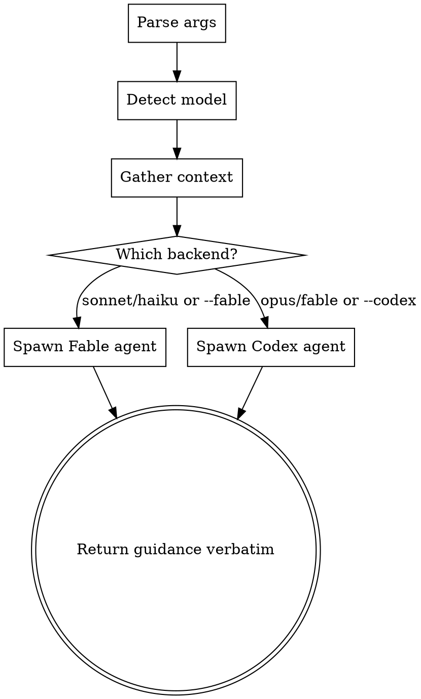

# Poor Man's Advisor

Consult a more capable model as an advisor for complex decisions. Inspired by Anthropic's advisor strategy — pairs a thinking model with your executor session at a fraction of the cost of running the advisor end-to-end.

## Invocation

```
/poormansadvisor "should I restructure this schema?"
/poormansadvisor --codex "is this migration safe?"
/poormansadvisor --fable "best approach for this refactor?"
```

Or invoked automatically when the skill triggers (see Auto-Trigger below).

## Argument Parsing

1. Check `$ARGUMENTS` for flags:
   - `--codex` → force Codex backend
   - `--fable` → force Fable backend
   - No flag → auto-route based on current model (see below)
2. Everything after the flag is the *question*

If no question is provided, ask the user what they want advice on.

## Auto-Routing

When no explicit `--fable` or `--codex` flag is given, route based on the *current* model:

| You are running as | Advisor becomes |
|---|---|
| Sonnet (any variant) | Fable |
| Haiku | Fable |
| Opus | Codex |
| Fable | Codex |

This ensures you always consult *up* — a more capable or differently-capable model.

To determine your current model: check the system prompt for "You are powered by the model named..." or the model ID field. If you cannot determine your model, default to Fable.

## Auto-Trigger

This skill should be invoked automatically (not just via `/poormansadvisor`) when ANY of these conditions are met:

1. **Stuck loop** — you've tried the same approach 2+ times and it's still failing
2. **Architectural uncertainty** — you're about to make a structural decision (new interface, schema change, cross-repo contract) and aren't confident
3. **Debugging spiral** — same error 3+ times with different attempted fixes
4. **Blast radius concern** — a change touches 3+ files across different subsystems
5. **"I'm not sure"** — you catch yourself hedging in your reasoning

When auto-triggering, frame the question around what you're stuck on. Include what you've tried and why it failed.

## Execution Flow



### Step 1: Gather Context Bundle

Before dispatching, collect a minimal context brief. Run these in parallel via Bash:

```bash
git diff --stat          # What's changed
git log --oneline -5     # Recent commits
pwd                      # Working directory
```

Also note:
- Any active tasks/plan visible in the current session
- The file(s) the user has been working on recently (from conversation context)
- If auto-triggered: what you tried and why it failed

Bundle this into a structured brief:

```
## Context
Working directory: <pwd>
Recent changes: <git diff stat summary>
Recent commits: <last 5 oneline>
Active work: <tasks/plan summary if any>
Files in play: <recent files from conversation>
What I tried: <if auto-triggered, describe failed approaches>

## Question
<user's question or auto-triggered question>
```

### Step 2a: Fable Backend

Use the `Agent` tool:

```yaml
Agent:
  description: "Fable advisor consultation"
  model: "fable"
  prompt: |
    You are an advisor. Your job is to provide thorough, expert guidance.
    You will NOT implement anything. You provide analysis, recommendations,
    and a clear plan of action for the executor to follow.

    Think deeply. Consider trade-offs, risks, edge cases, and alternatives.
    Be specific — name files, functions, line numbers where relevant.
    If you need to read code to give good advice, do so.

    <context>
    {context bundle from Step 1}
    </context>

    Provide your guidance in this structure:
    1. **Assessment** — what's the situation
    2. **Recommendation** — what to do and why
    3. **Risks** — what could go wrong
    4. **Steps** — concrete next actions for the executor
```

### Step 2b: Codex Backend

Use the `Agent` tool:

```yaml
Agent:
  description: "Codex advisor consultation"
  subagent_type: "codex:codex-rescue"
  prompt: |
    --effort xhigh

    Investigate and advise on the following. Do NOT implement changes —
    provide analysis and recommendations only.

    <context>
    {context bundle from Step 1}
    </context>

    Provide your guidance with:
    1. Assessment of the situation
    2. Recommended approach with rationale
    3. Risks and alternatives
    4. Concrete next steps
```

### Step 3: Return Guidance

Return the advisor's response *verbatim*. Do not:
- Summarize or paraphrase
- Add your own commentary before the response
- Filter or edit the guidance

After the verbatim response, add one line:

> *Advisor: {fable|codex} (auto-routed from {your model}) | To act on this guidance, proceed normally.*

## Rules

- The advisor *advises*. It does not implement.
- Max effort always: Fable gets full thinking depth. Codex gets `--effort xhigh`.
- Context first: always gather and pass the context bundle. Don't make the advisor waste tokens orienting itself.
- Verbatim return: the executor sees exactly what the advisor said.
- One consultation per invocation. For follow-up, invoke again.
- Auto-trigger honestly: if you catch yourself in a stuck loop or hedging, consult. Don't rationalize your way out of asking for help.
